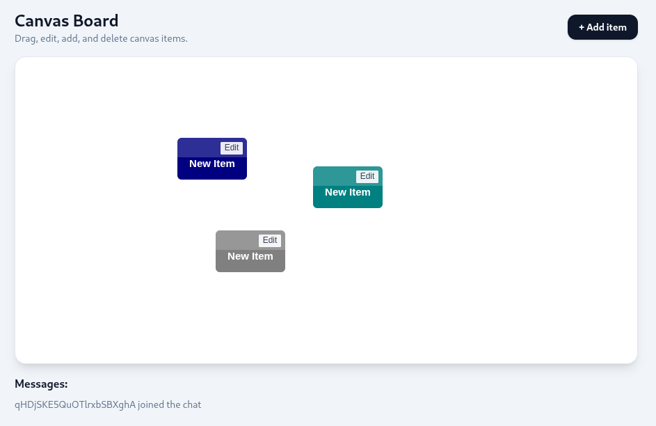

# Whiteboard

This project demonstrates a real-time collaboration board.

Whenever a new client connects to the board, they are given a connection id and the current state of the board is loaded. Any changes to the board are propagated to every client in realtime.



## Prerequisites 

* .NET 10 SDK
* node LTS

## Running the project

1. download repo
2. create a terminal in backend project and type `dotnet run`
3. create a terminal in frontend project and type `npm run dev`
4. load url provided by terminal in frontend project

## Frontend React project

* Uses react library to build the UI
* Implements a drawing loop to render a canvas element whenever new events are recieved
* Subscribes and sends events to backend project

### Organisation

```
components/ = reusable UI
features/   = feature-specific UI + logic
hooks/      = reusable React hooks
domain/     = pure business logic, classes, algorithms
services/   = outside-world code: API, storage, analytics
lib/        = small generic utilities
```

## Backend .NET project

* Uses .NET and Signalr to provide real time events
* Provides state management to hold the state of the board while the backend is running